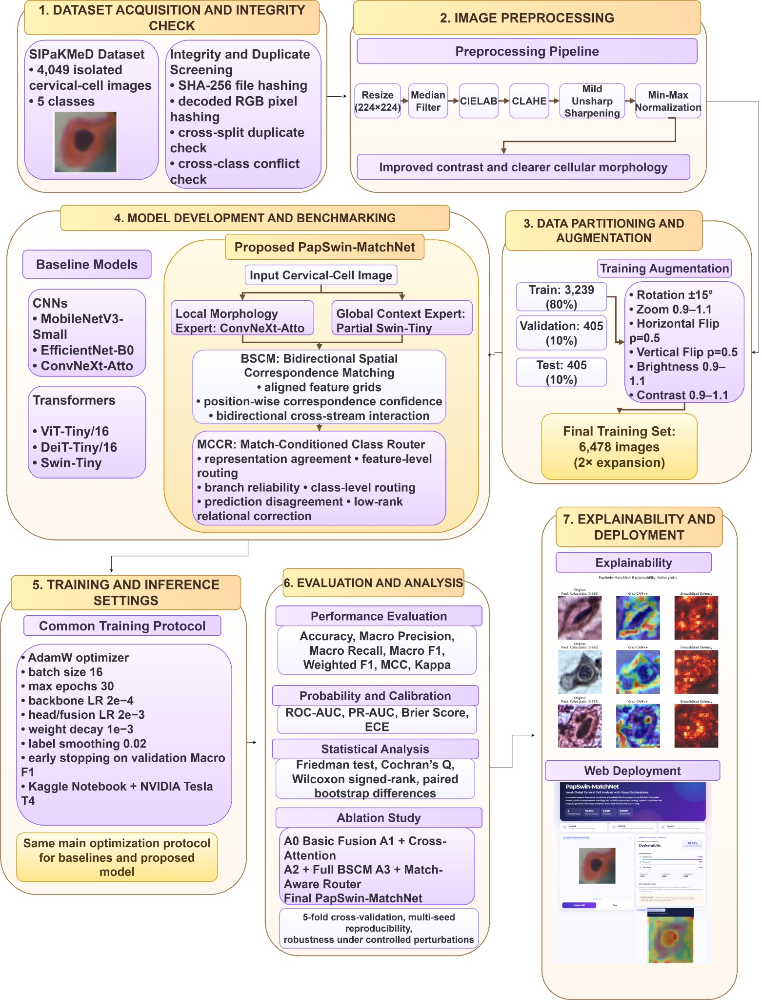
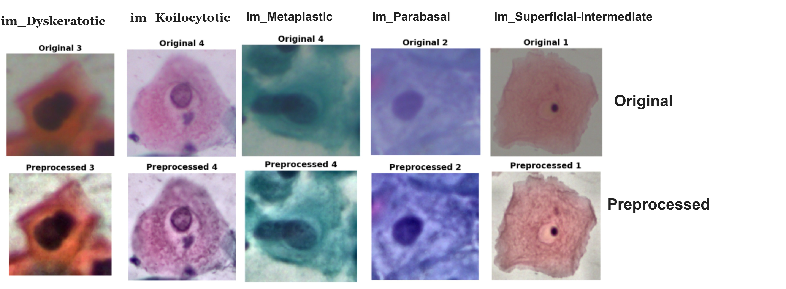
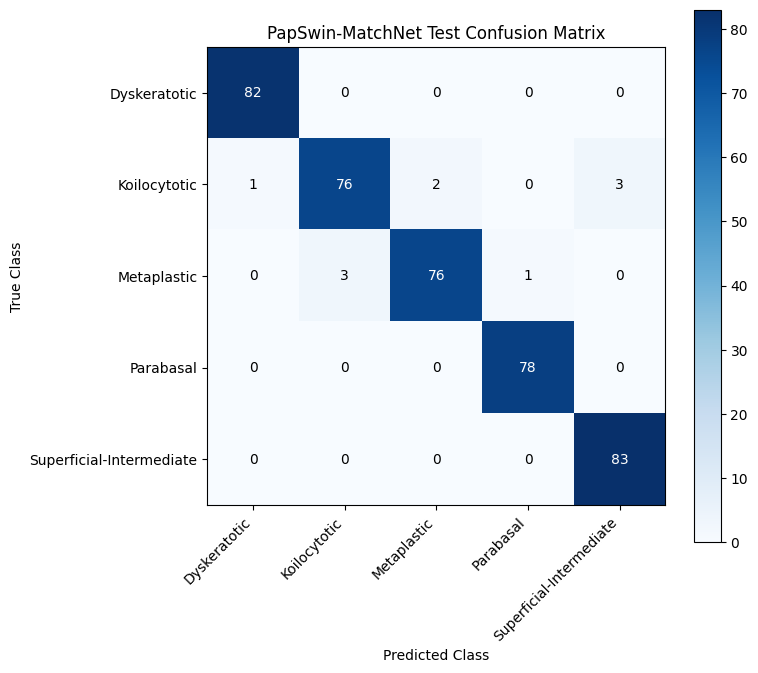
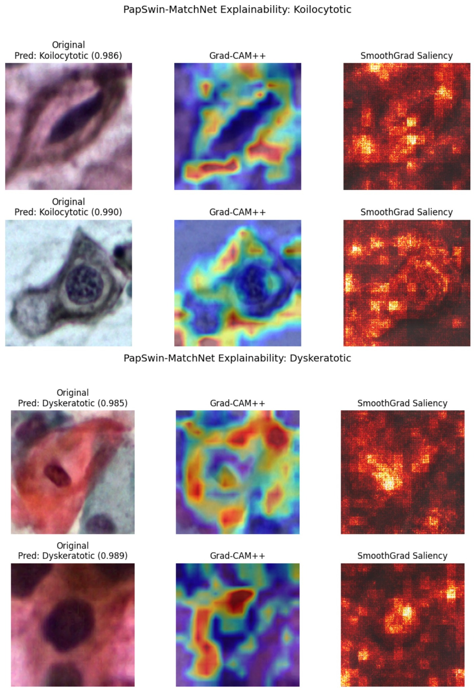
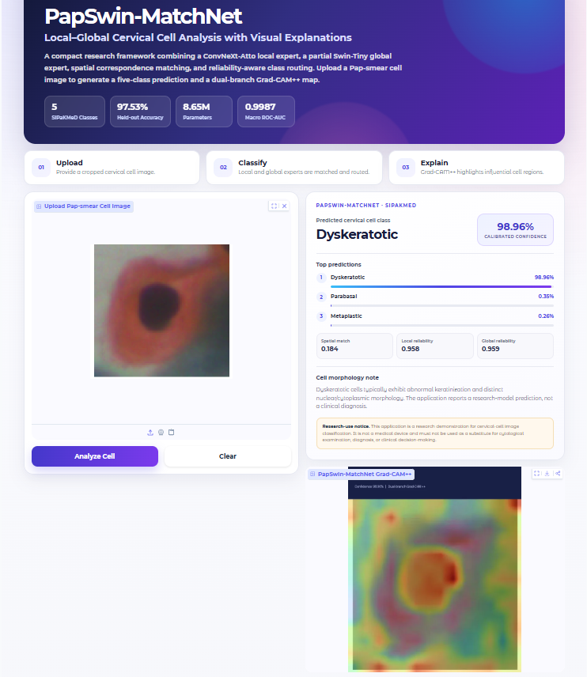

# PapSwin-MatchNet

## A Dual-Expert CNN–Transformer Network with Spatial Correspondence and Adaptive Routing for Cervical Cell Classification

PapSwin-MatchNet is a dual-expert CNN–Transformer framework developed for
five-class cervical-cell classification using the SIPaKMeD cervical cytology
dataset. The framework integrates a ConvNeXt-Atto local morphology expert with
a compact partial Swin-Tiny global context expert through spatial
correspondence matching and adaptive class routing.

> **Research Use Only**  
> This repository is intended for research, demonstration, and educational
> purposes. PapSwin-MatchNet is not a clinical diagnostic system and should
> not be used as a substitute for professional cytological examination.

---

# Authors

| Author | Affiliation | ORCID |
|---|---|---|
| **Md. Shakil Bhuiyan** | 1 | [0009-0000-0224-6870](https://orcid.org/0009-0000-0224-6870) |
| **Chinmoy Karmakar** | 1 | [0009-0009-4900-6861](https://orcid.org/0009-0009-4900-6861) |
| **Azizur Rahman** | 1 | [0009-0009-4900-6860](https://orcid.org/0009-0009-4900-6860) |
| **Md. Saymon Hosen Polash** | 2 | [0009-0003-7499-380X](https://orcid.org/0009-0003-7499-380X) |
| **Pintu Chandra Shill** | 2 | — |
| **Abdulrahman S. Alturki*** | 3 | — |
| **Jia Uddin*** | 4 | — |

\* Corresponding authors.

---

# Affiliations

**1. Department of Computer Science and Engineering**  
East West University, Dhaka 1212, Bangladesh

- Md. Shakil Bhuiyan — `bappibhuiyan10041@gmail.com`
- Chinmoy Karmakar — `chinmoykarmakar2025@gmail.com`
- Azizur Rahman — `aziz@gmail.com`

**2. Department of Mathematics and Data Science**  
East West University, Dhaka 1212, Bangladesh

- Md. Saymon Hosen Polash — `2026-1-83-032@std.ewubd.edu`
- Pintu Chandra Shill — `pintu.shill@ewubd.edu`

**3. Department of Electrical Engineering**  
College of Engineering, Qassim University  
Buraydah 51431, Saudi Arabia

- Abdulrahman S. Alturki — `abdulrahman@qec.edu.sa`

**4. AI and Big Data Department**  
Woosong University, Daejeon, Republic of Korea

- Jia Uddin — `jia.uddin@wsu.ac.kr`

### Correspondence

- Abdulrahman S. Alturki — `abdulrahman@qec.edu.sa`
- Jia Uddin — `jia.uddin@wsu.ac.kr`

---

# Abstract

Cervical cell classification remains challenging because morphologically
similar cell categories may differ only in subtle nuclear, cytoplasmic, and
textural characteristics. This motivates a framework that can jointly capture
fine local morphology and broader contextual information without depending on
a computationally heavy architecture.

This study proposes **PapSwin-MatchNet**, a local-global CNN–Transformer model
that combines a ConvNeXt-Atto morphology expert with a compact partial
Swin-Tiny context expert. **Bidirectional Spatial Correspondence Matching
(BSCM)** aligns the two feature streams using correspondence confidence and
bidirectional cross-attention. The **Match-Conditioned Class Router (MCCR)**
adaptively integrates the branches using branch reliability, prediction
disagreement, feature agreement, and low-rank relational correction.

The model was evaluated on the five-class SIPaKMeD dataset using a stratified
80:10:10 split and six CNN and Transformer baselines. PapSwin-MatchNet achieved
**97.53% test accuracy**, **0.9752 macro F1**, **0.9692 MCC**, and a
**macro ROC-AUC of 0.9987** with approximately **8.65 million parameters**.

Five-fold cross-validation yielded a mean accuracy of
**97.06% ± 0.96%**, while ablation analysis, paired statistical testing,
multi-seed experiments, calibration analysis, and controlled perturbations
were used to examine model stability. Grad-CAM++ and SmoothGrad provided
qualitative explanations, and a browser-based application illustrated
accessible deployment.

These results support correspondence-aware CNN–Transformer fusion with
adaptive routing for five-class cervical-cell classification.

---

# Keywords

`Cervical cell classification` · `Pap smear cytology` · `CNN–Transformer` ·
`ConvNeXt` · `Swin Transformer` · `Spatial correspondence` ·
`Adaptive routing` · `Explainable artificial intelligence`

---

# Framework Overview

PapSwin-MatchNet combines four major components:

- **ConvNeXt-Atto Local Expert**  
  Learns fine cellular morphology, texture, boundaries, and local cytological
  characteristics.

- **Partial Swin-Tiny Global Expert**  
  Learns broader contextual and hierarchical representations using shifted
  window attention.

- **Bidirectional Spatial Correspondence Matching (BSCM)**  
  Aligns local and global feature grids, estimates positional correspondence
  confidence, and performs confidence-guided bidirectional cross-attention.

- **Match-Conditioned Class Router (MCCR)**  
  Uses branch reliability, prediction disagreement, feature agreement,
  spatial matching confidence, feature-wise routing, class-wise routing,
  and low-rank relational correction to produce the final prediction.

---

# Overall Methodology



The complete experimental workflow includes:

1. Dataset acquisition
2. Dataset integrity and duplicate screening
3. Image preprocessing
4. Stratified data partitioning
5. Training-only augmentation
6. Baseline benchmarking
7. PapSwin-MatchNet model development
8. Training and validation
9. Classification and probabilistic evaluation
10. Statistical analysis
11. Ablation analysis
12. Five-fold cross-validation
13. Multi-seed reproducibility analysis
14. Controlled robustness analysis
15. Grad-CAM++ and SmoothGrad explainability
16. Browser-based deployment

---

# Dataset

The experiments use the publicly available **SIPaKMeD** cervical cytology
dataset through the Kaggle collection:

**Single Cell Conventional Pap Smear Images**

Kaggle dataset identifier:

```text
mohaliy2016/papsinglecell
```

The dataset contains **4,049 isolated cervical-cell images** distributed
across five cytomorphological classes.

## Class Distribution

| Class | Images |
|---|---:|
| Dyskeratotic | 813 |
| Koilocytotic | 825 |
| Metaplastic | 793 |
| Parabasal | 787 |
| Superficial-Intermediate | 831 |
| **Total** | **4,049** |

---

# Dataset Partition

A class-stratified **80:10:10** split with seed **42** was used.

| Class | Train | Validation | Test |
|---|---:|---:|---:|
| Dyskeratotic | 650 | 81 | 82 |
| Koilocytotic | 660 | 83 | 82 |
| Metaplastic | 634 | 79 | 80 |
| Parabasal | 630 | 79 | 78 |
| Superficial-Intermediate | 665 | 83 | 83 |
| **Total** | **3,239** | **405** | **405** |

Training augmentation generated one additional transformed image for each
original training sample.

Therefore:

```text
Original training images   = 3,239
Augmented images           = 3,239
Final training images      = 6,478
Validation images          = 405
Test images                = 405
```

---

# Dataset Integrity Screening

The complete dataset was screened before model development.

The integrity analysis included:

- SHA-256 file hashing
- Decoded RGB pixel hashing
- Within-partition duplicate checking
- Cross-partition duplicate checking
- Cross-class conflict screening
- Unreadable-image detection

| Integrity Check | Detected / Removed |
|---|---:|
| Within-split duplicates | 0 |
| Train-test duplicate conflicts | 0 |
| Cross-class conflict groups | 0 |
| Images removed for label conflict | 0 |
| Unreadable images | 0 |
| **Images retained** | **4,049** |

---

# Image Preprocessing

The preprocessing pipeline was designed to improve local contrast while
preserving cytological morphology.

Each image undergoes:

1. Resize to **224 × 224**
2. **3 × 3 median filtering**
3. RGB → **CIELAB**
4. CLAHE on the luminance channel
5. CLAHE clip limit = **2.0**
6. CLAHE grid = **8 × 8**
7. Mild unsharp masking
8. Gaussian sigma = **1.0**
9. Original-image weight = **1.15**
10. Blurred-image weight = **−0.15**
11. Min-max normalization to **0–255**
12. Tensor conversion
13. ImageNet normalization

ImageNet normalization:

```text
Mean = (0.485, 0.456, 0.406)
STD  = (0.229, 0.224, 0.225)
```

## Original vs Preprocessed Samples




---

# Training Augmentation

Augmentation was restricted to the training partition.

| Transformation | Setting |
|---|---:|
| Rotation | ±15° |
| Zoom | 0.9–1.1 |
| Horizontal flip | p = 0.5 |
| Vertical flip | p = 0.5 |
| Brightness | 0.9–1.1 |
| Contrast | 0.9–1.1 |

Validation and test images were not training-augmented.

---

# Baseline Models

PapSwin-MatchNet was evaluated against six ImageNet-pretrained baselines.

### CNN Baselines

- MobileNetV3-Small
- EfficientNet-B0
- ConvNeXt-Atto

### Transformer Baselines

- ViT-Tiny/16
- DeiT-Tiny/16
- Swin-Tiny

---

# Training Configuration

| Setting | Value |
|---|---:|
| Platform | Kaggle Notebook |
| GPU | NVIDIA Tesla T4 |
| Random seed | 42 |
| Input resolution | 224 × 224 |
| Batch size | 16 |
| Maximum epochs | 30 |
| Early stopping patience | 5 |
| Optimizer | AdamW |
| Initial backbone learning rate | 2 × 10⁻⁴ |
| Initial head/fusion learning rate | 2 × 10⁻³ |
| Weight decay | 1 × 10⁻³ |
| Label smoothing | 0.02 |
| Minimum learning rate | 1 × 10⁻⁶ |
| EMA decay | 0.995 |
| Model selection | Validation Macro F1 |
| Gradient clipping | Max norm = 5.0 |

### PapSwin-MatchNet-Specific Settings

| Setting | Value |
|---|---:|
| BSCM dimension | 96 |
| BSCM attention heads | 4 |
| BSCM attention dropout | 0.08 |
| MCCR hidden dimension | 96 |
| MCCR dropout | 0.10 |
| Relational correction rank | 64 |
| Auxiliary-loss weight | 0.08 |

---

# Main Test Performance

PapSwin-MatchNet was evaluated on the held-out **405-image test set**.

| Metric | Value |
|---|---:|
| Accuracy | **0.9753** |
| Balanced Accuracy | **0.9754** |
| Macro Precision | **0.9754** |
| Macro Recall | **0.9754** |
| Macro F1 | **0.9752** |
| Weighted F1 | **0.9751** |
| MCC | **0.9692** |
| Cohen's Kappa | **0.9691** |
| Macro ROC-AUC | **0.9987** |
| Weighted ROC-AUC | **0.9987** |
| Macro PR-AUC | **0.9955** |
| Brier Score | **0.0471** |
| Calibrated ECE | **0.0201** |
| Accuracy 95% CI | **[0.9580, 0.9877]** |

---

# Baseline Comparison

| Model | Accuracy | Macro Precision | Macro Recall | Macro F1 | Weighted F1 |
|---|---:|---:|---:|---:|---:|
| MobileNetV3-Small | 0.9160 | 0.9175 | 0.9161 | 0.9149 | 0.9145 |
| EfficientNet-B0 | 0.9407 | 0.9408 | 0.9406 | 0.9403 | 0.9402 |
| ConvNeXt-Atto | 0.9605 | 0.9607 | 0.9607 | 0.9601 | 0.9599 |
| ViT-Tiny/16 | 0.9506 | 0.9521 | 0.9506 | 0.9501 | 0.9499 |
| DeiT-Tiny/16 | 0.9333 | 0.9324 | 0.9331 | 0.9321 | 0.9323 |
| Swin-Tiny | 0.9654 | 0.9657 | 0.9655 | 0.9650 | 0.9649 |
| **PapSwin-MatchNet** | **0.9753** | **0.9754** | **0.9754** | **0.9752** | **0.9751** |

---

# Confusion Matrix

PapSwin-MatchNet correctly classified **395 of the 405 test images**.



Dyskeratotic, Parabasal, and Superficial-Intermediate cells achieved complete
recall on the fixed test set, while most remaining errors occurred between
Koilocytotic and Metaplastic samples.

---

# Ablation Study

| Variant | Accuracy | Kappa | Brier Score | Accuracy 95% CI |
|---|---:|---:|---:|---:|
| A0: Basic Local-Global Fusion | 0.9630 | 0.9537 | 0.0569 | [0.9432, 0.9802] |
| A1: + Bidirectional Cross-Attention | 0.9679 | 0.9599 | 0.0510 | [0.9506, 0.9827] |
| A2: + Full BSCM | 0.9654 | 0.9568 | 0.0559 | [0.9481, 0.9803] |
| A3: + Match-Aware Feature Router | 0.9704 | 0.9630 | 0.0514 | [0.9531, 0.9852] |
| **PapSwin-MatchNet** | **0.9753** | **0.9691** | **0.0471** | **[0.9580, 0.9877]** |

---

# Five-Fold Cross-Validation

| Fold | Accuracy | Balanced Accuracy | Macro F1 | MCC | Kappa | Macro ROC-AUC |
|---|---:|---:|---:|---:|---:|---:|
| Fold 1 | 0.9716 | 0.9719 | 0.9715 | 0.9647 | 0.9645 | 0.9981 |
| Fold 2 | 0.9704 | 0.9706 | 0.9704 | 0.9630 | 0.9630 | 0.9987 |
| Fold 3 | 0.9568 | 0.9570 | 0.9570 | 0.9460 | 0.9460 | 0.9978 |
| Fold 4 | 0.9704 | 0.9704 | 0.9704 | 0.9630 | 0.9630 | 0.9981 |
| Fold 5 | 0.9839 | 0.9840 | 0.9840 | 0.9799 | 0.9799 | 0.9997 |
| **Mean ± SD** | **0.9706 ± 0.0096** | **0.9708 ± 0.0096** | **0.9707 ± 0.0096** | **0.9633 ± 0.0120** | **0.9633 ± 0.0120** | **0.9985 ± 0.0008** |

> **Reproducibility note:** If the five-fold augmentation or training code is
> changed, regenerate this table before creating the final archival release.

---

# Multi-Seed Reproducibility

Five independent training seeds were evaluated.

| Seed | Accuracy | Macro F1 | MCC | Kappa | Macro ROC-AUC |
|---|---:|---:|---:|---:|---:|
| 20 | 0.9728 | 0.9727 | 0.9662 | 0.9660 | 0.9984 |
| 42 | 0.9753 | 0.9752 | 0.9692 | 0.9691 | 0.9987 |
| 56 | 0.9679 | 0.9677 | 0.9602 | 0.9599 | 0.9985 |
| 100 | 0.9728 | 0.9727 | 0.9662 | 0.9660 | 0.9977 |
| 200 | 0.9654 | 0.9650 | 0.9570 | 0.9568 | 0.9974 |
| **Mean ± SD** | **0.9708 ± 0.0041** | **0.9707 ± 0.0042** | **0.9638 ± 0.0050** | **0.9636 ± 0.0050** | **0.9981 ± 0.0006** |

---

# Robustness Analysis

PapSwin-MatchNet was evaluated under seven controlled input perturbations.

| Condition | Accuracy | Macro F1 | MCC | Macro ROC-AUC |
|---|---:|---:|---:|---:|
| Clean | 0.9753 | 0.9752 | 0.9692 | 0.9987 |
| Gaussian Noise (σ=0.02) | 0.9556 | 0.9548 | 0.9455 | 0.9980 |
| Gaussian Blur (r=0.6) | 0.9728 | 0.9727 | 0.9661 | 0.9986 |
| Brightness (+8%) | 0.9704 | 0.9701 | 0.9631 | 0.9988 |
| Contrast (−8%) | 0.9728 | 0.9726 | 0.9662 | 0.9987 |
| JPEG Compression (q=85) | 0.9679 | 0.9676 | 0.9600 | 0.9974 |
| Rotation (+3°) | 0.9654 | 0.9653 | 0.9569 | 0.9985 |
| Gamma (γ=1.08) | 0.9728 | 0.9726 | 0.9662 | 0.9988 |

These experiments represent **controlled input-space perturbations** rather
than independent clinical-domain validation.

---

# Explainability

Grad-CAM++ and SmoothGrad were used to provide qualitative explanations of
model predictions.



The explanation maps are intended for qualitative model interpretation and
have not been clinically validated.

---

# Web Application

The final PapSwin-MatchNet checkpoint was integrated into a browser-based
Gradio interface.

The application provides:

- Predicted cervical-cell category
- Calibrated prediction confidence
- Top-3 class probabilities
- Local expert reliability
- Global expert reliability
- Spatial matching confidence
- Grad-CAM++ visualization



The deployed interface is intended strictly for research, educational, and
demonstration purposes.

---

# Repository Structure

```text
PapSwin-MatchNet/
│
├── README.md
├── requirements.txt
├── .gitignore
│
├── notebooks/
│   └── PapSwin_MatchNet.ipynb
│
├── scripts/
│   └── download_dataset.py
│
├── data/
│   └── README.md
│
├── figures/
│   ├── overall_methodology.jpg
│   ├── preprocessing_comparison.png
│   ├── confusion_matrix.png
│   ├── explainability.jpg
│   └── web_app.png
│
└── results/
    └── README.md
```

---

# Experimental Notebook

The main implementation is available here:

[`notebooks/PapSwin_MatchNet.ipynb`](PapSwin-MatchNet/notebooks/PapSwin_MatchNet.ipynb)

The notebook contains:

- Dataset acquisition
- Dataset integrity analysis
- Duplicate screening
- Preprocessing
- Dataset partitioning
- Training augmentation
- Baseline training
- PapSwin-MatchNet implementation
- Evaluation
- Temperature scaling
- Calibration analysis
- Bootstrap analysis
- Statistical hypothesis testing
- Ablation experiments
- Five-fold cross-validation
- Robustness analysis
- Multi-seed experiments
- Grad-CAM++ and SmoothGrad generation

---

# Installation

Create a Python environment:

```bash
python -m venv .venv
```

### Windows

```bash
.venv\Scripts\activate
```

Install the required packages:

```bash
pip install -r requirements.txt
```

For GPU training, install the PyTorch build compatible with your CUDA
environment.

---

# Dataset Download

The dataset can be downloaded programmatically using:

```bash
python scripts/download_dataset.py
```

The script uses KaggleHub:

```python
import kagglehub

path = kagglehub.dataset_download(
    "mohaliy2016/papsinglecell"
)

print(path)
```

The original public dataset should be cited appropriately when this repository
is used in research.

---

# Funding

The researchers gratefully acknowledge the **Deanship of Graduate Studies and
Scientific Research at Qassim University** for providing financial support
under grant:

**QU-APC-2026**

Qassim University:  
https://www.qu.edu.sa

---

# Conflict of Interest

The authors declare that they have **no conflict of interest**.

---

# Ethics Statement

**Not applicable.**

The study was conducted using an existing publicly available cervical-cell
image dataset and did not involve new recruitment of human participants or
new clinical data collection.

---

# Data Availability

The experiments were conducted using the publicly available **Single Cell
Conventional Pap Smear Images** dataset, a reorganized single-cell version of
the original SIPaKMeD database.

Dataset identifier:

```text
mohaliy2016/papsinglecell
```

Users are encouraged to obtain the original dataset from its public source and
cite the corresponding dataset and SIPaKMeD publication.

---

# Citation

If you use this repository or PapSwin-MatchNet in your research, please cite
the associated manuscript once its final publication information is available.

```bibtex
@article{papswinmatchnet2026,
  title   = {PapSwin-MatchNet: A Dual-Expert CNN--Transformer Network with Spatial Correspondence and Adaptive Routing for Cervical Cell Classification},
  author  = {Bhuiyan, Md. Shakil and
             Karmakar, Chinmoy and
             Rahman, Azizur and
             Polash, Md. Saymon Hosen and
             Shill, Pintu Chandra and
             Alturki, Abdulrahman S. and
             Uddin, Jia},
  year    = {2026},
  note    = {Manuscript}
}
```

The citation entry should be replaced with the final DOI, journal, volume,
issue, pages/article number, and publication year after publication.

---

# License

No open-source license has yet been assigned to this repository.

Before adding a license, the authors should determine the intended conditions
for reuse, redistribution, and modification of the source code.

---

# Disclaimer

This software and the associated web application are research prototypes.
They have not undergone clinical validation or regulatory approval and must
not be used for diagnosis, treatment decisions, or other clinical purposes.
